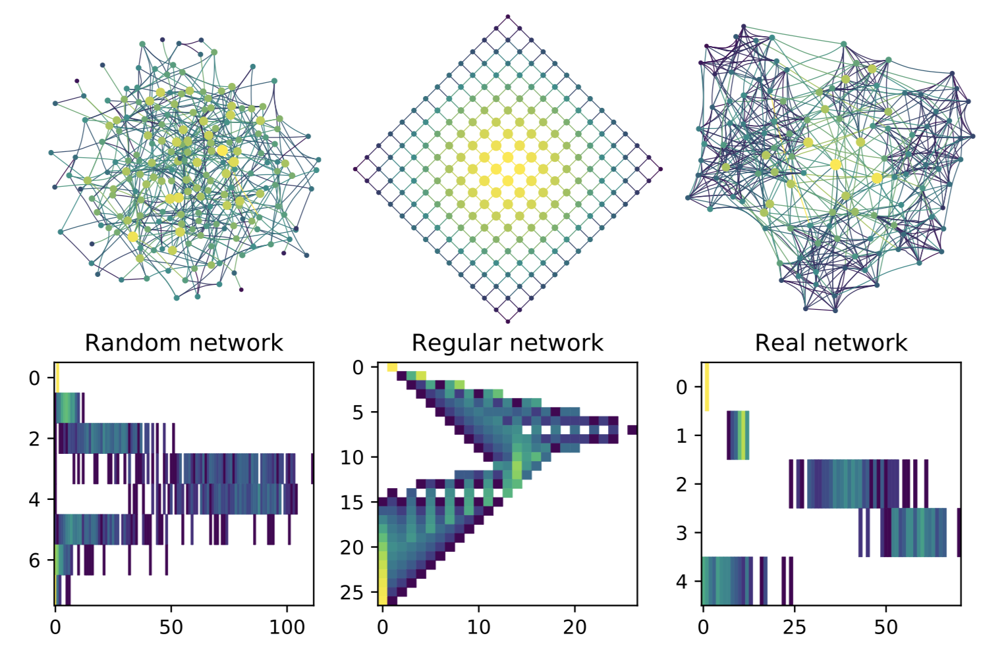

Network Portrait Divergence
===================

Python code for computing **network portrait divergences**, a simple, general-purpose
tool for comparing networks.


<p align="center">

</p>


Please see the paper for more details:

**An information-theoretic, all-scales approach to comparing networks**  
James P. Bagrow and Erik M. Bollt, [Applied Network Science, 4 (1): 45](https://doi.org/10.1007/s41109-019-0156-x) (2019)  
[arXiv:1804.03665](https://arxiv.org/abs/1804.03665)


### Table of Contents
- [Usage](#usage)
- [Requirements](#requirements)
- [Citation ](#citation)


## Usage  <a name="usage"/>

The output of each calculation is a float between 0 and 1 describing how
similar the two networks are (0 = identical, 1 = maximally different, according
to this measure).


Network portrait divergences can be computed at the command line or within
Python scripts:

#### Command line

1. Basic example:  
    `python portrait_divergence.py data/net1.edgelist data/net2.edgelist`

1. Networks stored in
   [GraphML](https://networkx.github.io/documentation/networkx-1.10/reference/readwrite.graphml.html)
   files:  
    `python portrait_divergence.py -graphml digraph_time1.graphml digraph_time2.graphml`

1. Use faster C++ code (assuming it's installed):  
    `python portrait_divergence.py --cpp big_g.edgelist big_h.edgelist`

1. Let's get crazy:  
    `python portrait_divergence.py --weighted=strength -b 10 --graphml g.graphml h.graphml`


The code supports directed and weighted networks.

See the help string for more: `python portrait_divergence.py -h`

#### Python

Here's a script to compare
[Erdős-Rényi](https://en.wikipedia.org/wiki/Erdős–Rényi_model)
and
[Barabási-Albert](https://en.wikipedia.org/wiki/Barabási–Albert_model) graphs:

```Python
import networkx as nx
from portrait_divergence import portrait_divergence

Ger1  = nx.erdos_renyi_graph(100, 3/99)
Ger2  = nx.erdos_renyi_graph(100, 3/99)
Gba1 = nx.barabasi_albert_graph(100, 3)
Gba2 = nx.barabasi_albert_graph(100, 3)

print("Djs(ER1,ER2) =", portrait_divergence(Ger1, Ger2))
print("Djs(ER1,BA1) =", portrait_divergence(Ger1, Gba1))
print("Djs(ER1,BA2) =", portrait_divergence(Ger1, Gba2))
print("Djs(BA1,BA2) =", portrait_divergence(Gba1, Gba2))
```

Result:
```text
Djs(ER1,ER2) = 0.139438811433
Djs(ER1,BA1) = 0.831004770397
Djs(ER1,BA2) = 0.864124658944
Djs(BA1,BA2) = 0.214176902159
```


## Requirements  <a name="requirements"/>

* [Python 3.x](https://www.python.org) with packages:
    + [Numpy](http://numpy.scipy.org/)
    + [Scipy](http://www.scipy.org/)
    + [NetworkX](https://networkx.github.io)

A recent install of [Anaconda Python](https://www.anaconda.com) should come with everything you need.


## Citation   <a name="citation"/>

If you use Network Portrait Divergence, please cite our paper:

James P. Bagrow and Erik M. Bollt, An information-theoretic, all-scales approach to comparing networks, *Applied Network Science*, 4 (1): 45 (2019)
[arXiv:1804.03665](https://arxiv.org/abs/1804.03665)

Here is a bibtex entry:
```text
@article{bagrow2019information,
	Author = {Bagrow, James P. and Bollt, Erik M.},
	Doi = {10.1007/s41109-019-0156-x},
	Journal = {Applied Network Science},
	Number = {1},
	Pages = {45},
	Title = {An information-theoretic, all-scales approach to comparing networks},
	Doi = {10.1007/s41109-019-0156-x},
	eprint = {1804.03665},
	Volume = {4},
	Year = {2019},
}
```


### See also:

*[Portraits of Complex Networks](http://dx.doi.org/10.1209/0295-5075/81/68004)*
&mdash; the original paper on Network Portraits, one of the ideas behind
Network Portrait Divergence.

* [Journal Page](http://dx.doi.org/10.1209/0295-5075/81/68004)
* [arXiv:cond-mat/0703470](http://arxiv.org/abs/cond-mat/0703470)
* [github.com/bagrow/portraits](https://github.com/bagrow/portraits)
